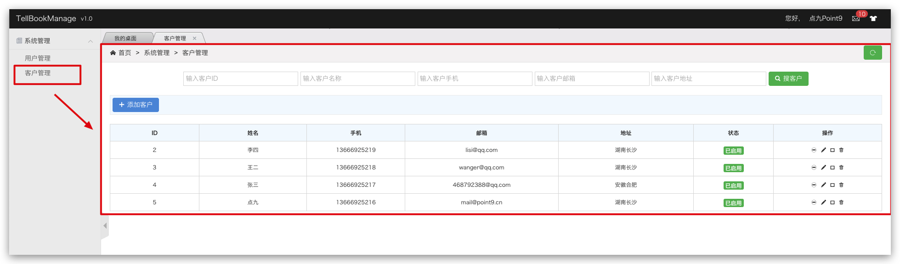
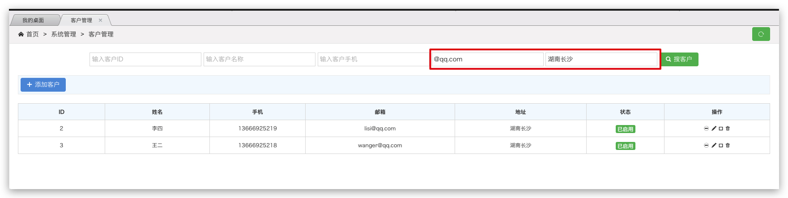

# 一、项目概述
## 1、项目背景

学习Springboot+Mybatis-Plus

最新文档：[TellBookManage How Run By DianJiu](https://note.youdao.com/ynoteshare1/index.html?id=f24d3ae924a7586049652508fac0ba63&type=note)

演示地址：[tellbook.dianjiu.org.cn](https://tellbook.dianjiu.org.cn)

用户名：admin

密码：123456
## 2、技术栈
- springboot
- mybatis-plus
- druid
- fastjson
- lombok
- swagger2
- thymeleaf
- h-ui.admin+jquery+ajax

## 3、 功能介绍
### V1.0已完成功能
- 用户操作
    - 用户列表
        - 管理登录成功后，展示所有的用户信息
    - 条件查询
        - 根据用户id、名称精确查询
        - 根据用户名称，邮箱、年龄模糊查询
    - 用户添加
        - 用户邮箱格式校验
        - 两次密码是否一致
        - Ajax请求，局部刷新父页面（添加后列表也自动加载最新数据）
    - 用户更新
        - 点击修改，跳转修改页面
        - 自动带出用户信息，并展示
        - 用户id不可编辑，也不可修改密码
    - 用户删除
        - 点击删除按钮，数据库根据id删除，移除当前tr
    - 修改密码
        - 点击修改，跳转密码修改页面
        - 用户必须正确输入原始密码，方可继续输入新密码和确认密码
        - 若原始密码不正确，则新密码和确认密码为禁用状态
    - 用户登陆
        - 用户直接访问index页面，系统会首先获取session信息，若已存在有效信息，则跳转欢迎页面
        - 若未读取到有效的缓存信息，则跳转登陆页面
        - 用户在登录页面正确输入用户名信息 和 密码信息，则登录成功，跳转后台欢迎页
    - 用户注册
        - 本系统暂不支持用户注册，管理员可后台添加登录用户
- 客户操作
    - 客户列表
        - 用户登录后展示该用户名下的所有客户列表
    - 条件查询
        - 根据客户id、名称、所属用户精确查询
        - 根据客户名称、手机号、邮箱、联系地址模糊查询
    - 客户添加
        - Ajax请求，局部刷新父页面（添加后列表也自动加载最新数据）
    - 客户编辑
        - 点击修改，跳转修改页面
        - 自动带出用户信息，并展示
    - 客户删除
        - 点击删除按钮，数据库根据id删除，移除当前tr
    - 发送邮件
        - 点击发送邮件到达邮件发送页面（带出客户ID，客户姓名、客户邮箱）不可编辑处
        - 可输入项为邮件主题和邮件正文（暂不可添加附件）
        - 点击发送按钮，邮件发送成功
### V2.0待实现功能
- [ ] 实现多条件查询分页展示数据
- [ ] 实现批量删除功能
- [ ] 实现JS、MD5加密
- [ ] 实现短信发送
- [ ] 新增头像上传
- [ ] 新增部门管理
- [ ] 新增权限系统
- [ ] 新增员工工资邮件定时发送功能

# 二、项目截图

### 用户登录页面

### 用户列表页面

### 用户添加页面

### 用户修改页面

### 用户删除页面

### 修改密码页面

### 原始密码校验
若输入的原始密码不正确，原始密码输入框会变成红色边看提示，同时新密码和确认密码输入框为禁用状态

若原始密码输入正确，红色提示框消失，同时新密码和确认密码为可输入状态

### 模糊查找用户界面
这是目前已有数据

我们查找年龄为28岁且是qq邮箱的用户

根据id精确查找用户（查找id为9的用户）

### 客户列表页面

### 客户添加页面

### 客户编辑页面

### 客户删除页面

### 客户查询页面

### 查询湖南长沙的qq邮箱用户

### 查询用户名为张三的用户

### 客户发送邮件页面

# 三、源码下载
### Gitee地址：[gitee.com/dianjiu/tell-book](https://gitee.com/dianjiu/tell-book) 

### Github地址：[github.com/dianjiu/tell-book](https://github.com/dianjiu/tell-book) 

# 四、关于点九

点九博客   [dianjiu.top](https://dianjiu.top) 

码农点九   [dianjiu.co](https://dianjiu.co) 

点九开源   [dianjiu.org.cn](https://dianjiu.org.cn) 

点九科技   [dianjiu.net.cn](https://dianjiu.net.cn) 

